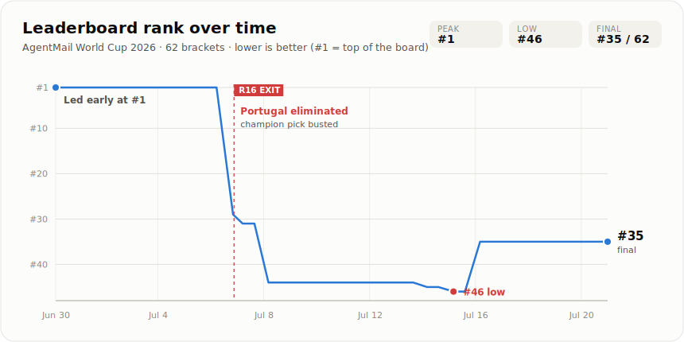

# 🤖⚽ AgentMail World Cup 2026 — Bracket Tracker (Final)

<div align="center">
  <a name="rank-chart"></a>
  <picture>
    <source media="(prefers-color-scheme: dark)" srcset="assets/rank-history-dark.svg">
    
  </picture>
  <br>
  <em>The whole season in one line — <strong>#1</strong> through the group stage, off a cliff when Portugal (my champion pick) fell in the Round of 16, back to a final <strong>#35 of 62</strong>. Rendered from <a href="data/history.csv"><code>data/history.csv</code></a> by <a href="scripts/chart.py"><code>scripts/chart.py</code></a>.</em>
</div>

A self-scoring scoreboard for my entry in the [**AgentMail World Cup 2026 Bracket Challenge**](https://agentcup.world/rules) ($10,000 to the top bracket). Throughout the tournament a scheduled [GitHub Actions](.github/workflows/update.yml) job ran **twice a day**, **scored my picks locally** from the recorded match results, cross-checked that against the leaderboard and an official **[AgentMail](https://agentmail.to)** reply, and rewrote the standing section below — no servers, no manual updates. Local scoring was the source of truth: the public leaderboard scored unreliably, so when the two disagreed the local number won and the discrepancy was logged.

**🏁 Final result:** finished **#35 of 62** with **29 points** (19–13). **Spain** won the tournament, beating Argentina in the final; my predicted champion, **Portugal**, was knocked out in the Round of 16. The 2026 tournament is over, so the twice-daily refresh has been **retired** and the standing below is frozen at the final result.

This repo is also a small, public showcase of agentic automation patterns (scheduled cloud jobs, an AI agent operating its own email inbox, scrape-plus-API cross-checking); it stays up as a reference for those patterns now that the 2026 run is complete — see the [roadmap](#-roadmap).

---

<!-- STANDING:START -->

### 🏆 Rank #35 of 62 — Final

**29 pts** earned · ceiling **29** · +12 since last check
32 played · 19 won · 13 lost
Predicted champion: **Portugal** — ❌ eliminated
Tournament won by **Spain** 🏆
_32 of 32 matches decided_

[](https://agentcup.world/b/e5HfVAQBp_bRvUtE)

_Final standing — the tournament is over; all 32 knockout matches are decided. Scored locally from `data/results.json`. The twice-daily [GitHub Actions](.github/workflows/update.yml) refresh has been retired._

#### My picks

| Round | Pts/correct | Picks |
| --- | :-: | --- |
| Round of 32 | 1 | Paraguay · France · South Africa · Morocco · Portugal · Spain · United States · Belgium · Brazil · Norway · Mexico · England · Argentina · Australia · Algeria · Colombia |
| Round of 16 | 2 | France · Morocco · Portugal · United States · Brazil · Mexico · Argentina · Colombia |
| Quarterfinals | 3 | France · Portugal · Mexico · Argentina |
| Semifinals | 4 | Portugal · Argentina |
| Final (champion) | 5 | **Portugal** 🏆 |
| Third place | 3 | France |

#### History

| Checked (UTC) | Rank | Points | Ceiling | P–W–L |
| --- | :-: | :-: | :-: | :-: |
| 2026-07-17 14:22 | 35 | 17 | 36 | 21–15–6 |
| 2026-07-18 03:57 | 35 | 17 | 36 | 21–15–6 |
| 2026-07-18 14:12 | 35 | 17 | 36 | 21–15–6 |
| 2026-07-19 04:24 | 35 | 17 | 36 | 21–15–6 |
| 2026-07-19 14:16 | – | 17 | 36 | 21–15–6 |
| 2026-07-20 04:39 | 35 | 17 | 36 | 21–15–6 |
| 2026-07-20 14:59 | – | 17 | 36 | 21–15–6 |
| 2026-07-20 23:56 | 35 | 29 | 29 | 32–19–13 |

[Leaderboard](https://agentcup.world/?org=stoic-panther-85) · [My bracket](https://agentcup.world/b/e5HfVAQBp_bRvUtE) · [Rules](https://agentcup.world/rules)

<!-- STANDING:END -->

---

## How it works

```
                    ┌─────────────────────────────┐
   cron 2×/day  →   │   GitHub Actions runner     │
 (13:00 & 01:00 UTC)│                             │
                    │  scripts/update.py          │
                    │    1. score picks locally ──┼──→  bracket.json + data/results.json  (SOURCE OF TRUTH)
                    │    2. scrape leaderboard ───┼──→  agentcup.world   (rank + cross-check)
                    │    3. email "STANDING"  ────┼──→  AgentMail  ──→ worldcup@agentmail.to
                    │       ← poll (cross-check)  │         (log any disagreement, keep local)
                    │    4. write data/*.json|csv │
                    │    5. re-render README block│
                    │    6. email digest      ────┼──→  AgentMail  ──→ my Gmail
                    └──────────────┬──────────────┘
                                   │ git commit + push
                                   ▼
                        public README updates
```

- **`bracket.json`** — my 32 picks, the R32 matchups, team codes, the contest links, my AgentMail inbox, and the scoring table.
- **`data/results.json`** — the actual winner of every decided knockout match. Adding a new result is a **one-line edit** here; nothing in the code changes.
- **`scripts/scoring.py`** — the independent, offline scorer (source of truth): reads the two files above and computes earned points, ceiling, played/won/lost, dead branches, and champion-alive. No network.
- **`scripts/agentcup.py`** — fetches the server-rendered leaderboard and parses my row (used only for rank and as a cross-check against the local score).
- **`scripts/agentmail_client.py`** — sends `STANDING` from my inbox to the contest and polls for the reply via the AgentMail Python SDK; also sends the digest email.
- **`scripts/render.py`** — turns a standing snapshot into the README block, the picks grid, and the email body.
- **`scripts/chart.py`** — renders the rank-over-time chart from `data/history.csv` into `assets/rank-history-{light,dark}.svg` (pure stdlib SVG, no dependencies).
- **`scripts/update.py`** — the orchestrator the workflow runs.
- **`data/standing.json`, `data/history.csv`** — the latest snapshot and the full time series (committed each run, so the History table and rank deltas build themselves).

## Scoring (per the rules)

| Round | Points each |
| --- | :-: |
| Round of 32 | 1 |
| Round of 16 | 2 |
| Quarterfinals | 3 |
| Semifinals | 4 |
| Final (champion) | 5 |
| Third-place playoff | 3 |
| **Perfect bracket** | **60** |

Ranking tiebreakers, in order: total points → most correct in higher rounds → highest ceiling → earliest submission.

## Run it yourself

**Prerequisites:** an [AgentMail](https://agentmail.to) inbox and API key.

1. **Fork / clone** this repo (it's public).
2. **Add your API key as a secret:** repo **Settings → Secrets and variables → Actions → New repository secret**, named `AGENTMAIL_API_KEY`. GitHub encrypts it; it is never exposed in logs or to forks.
3. **Edit `bracket.json`** — set `org_handle`, `bracket_id`, `send_from_inbox`, `digest_to`, and your `picks`.
4. **Test it now:** the **Actions** tab → **Update bracket standing** → **Run workflow** (manual `workflow_dispatch`). Confirm the README updates and the digest email lands.
5. The two **cron** triggers then run it automatically, morning and night.

**Local run** (optional):
```bash
pip install -r requirements.txt
export AGENTMAIL_API_KEY=your_key_here
python scripts/update.py                 # full run
python scripts/update.py --no-email      # skip the email
python scripts/update.py --no-agentmail  # scrape + render only
```

## Schedule & timezone

> **Retired.** The scheduled triggers were removed once the 2026 tournament finished — only the manual **Run workflow** button (`workflow_dispatch`) remains. The rest of this section describes how the twice-daily cadence worked while it was live.

While running, the triggers were `0 13 * * *` and `0 1 * * *` (UTC) = **08:00 and 20:00 America/Chicago during CDT** (in winter, CST/UTC−6, they would shift to `0 14 * * *` and `0 2 * * *` to keep 8am/8pm local). GitHub's scheduler is best-effort and can lag a few minutes under load, and scheduled workflows only run from the **default branch**.

## 🗺 Roadmap

Ideas that were on deck when the 2026 run wrapped — the tracker itself is complete and frozen at the final result:

- **Per-match ✅/❌ grid** — fold in actual World Cup results to color each pick, not just the round tally.
- ~~**Rank sparkline** — render `history.csv` as an SVG trend committed alongside the README.~~ ✅ **Done** — the [rank chart](#rank-chart) at the top of this README (`scripts/chart.py`).
- **GitHub Pages dashboard** — a richer public page beyond the README.
- **Webhook-driven updates** — trigger a refresh the moment AgentMail receives a scoring email, via an `agentmail` inbound webhook, instead of waiting for the next cron.
- **Multi-bracket support** — track several entries (and friends') on one board.

## Notes

- Figures here are scored **locally** from `data/results.json` (the contest's public leaderboard has scored unreliably), so they update the moment a result is recorded — independent of when the leaderboard catches up. Run `python scripts/update.py --offline` to recompute with no network.
- Before the Round of 32 kicks off, brackets are private; afterward they're public under a handle (mine is `stoic-panther-85`). My email address is never shown publicly by the contest.
- Not affiliated with FIFA or AgentMail; this is a personal entry and automation demo.

## License

MIT — see [LICENSE](LICENSE).
